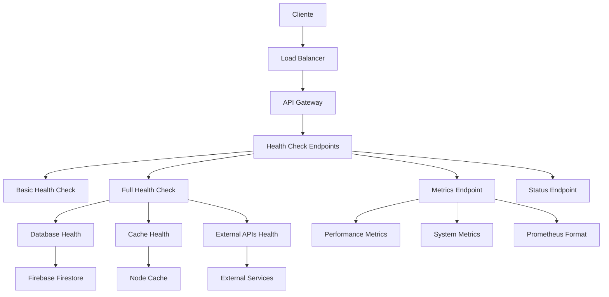

# 🏥 Sistema de Health Checks y Métricas - API RESTful VolleyballArt

## 📋 Índice

1. [Resumen Ejecutivo](#resumen-ejecutivo)
2. [Arquitectura del Sistema](#arquitectura-del-sistema)
3. [Endpoints Implementados](#endpoints-implementados)
4. [Sistema de Constantes Centralizadas](#sistema-de-constantes-centralizadas)
5. [Estructura de Archivos](#estructura-de-archivos)
6. [Configuración y Uso](#configuración-y-uso)
7. [Ejemplos de Respuestas](#ejemplos-de-respuestas)
8. [Monitoreo y Alertas](#monitoreo-y-alertas)
9. [Integración con Herramientas Externas](#integración-con-herramientas-externas)
10. [Mejores Prácticas](#mejores-prácticas)

---

## 🎯 Resumen Ejecutivo

El sistema de Health Checks y Métricas de la API RESTful VolleyballArt es una solución completa de monitoreo y observabilidad diseñada para proporcionar visibilidad en tiempo real del estado del sistema, rendimiento de la aplicación y salud de las dependencias.

### ✨ Características Principales

- **🏥 Health Checks Multi-nivel**: Verificaciones básicas y completas del sistema
- **📊 Métricas en Tiempo Real**: Recolección y exposición de métricas de rendimiento
- **🚨 Sistema de Alertas**: Notificaciones automáticas basadas en umbrales
- **📈 Compatibilidad Prometheus**: Exportación de métricas para Grafana
- **🔧 Debug Avanzado**: Información técnica detallada para troubleshooting
- **🌐 Estado Público**: Dashboard de estado para usuarios finales
- **💻 Constantes Centralizadas**: Sistema de configuración mantenible

---

## 🏗️ Arquitectura del Sistema



### 🔄 Flujo de Monitoreo

1. **Recolección**: El sistema recolecta métricas continuamente
2. **Agregación**: Las métricas se agregan y procesan
3. **Evaluación**: Se evalúan contra umbrales configurados
4. **Alertas**: Se generan alertas cuando se superan los umbrales
5. **Exposición**: Las métricas se exponen a través de endpoints REST

---

## 🌐 Endpoints Implementados

### 1. **Health Check Básico**
```http
GET /api/health
```
- **Propósito**: Verificación rápida para balanceadores de carga
- **Autenticación**: No requerida
- **Tiempo de respuesta**: < 50ms
- **Estados**: `healthy` | `unhealthy`

### 2. **Health Check Completo**
```http
GET /api/health/full
```
- **Propósito**: Verificación exhaustiva del sistema y dependencias
- **Autenticación**: No requerida
- **Estados**: `healthy` | `degraded` | `unhealthy`
- **Incluye**: Base de datos, cache, APIs externas, métricas de sistema

### 3. **Historial de Health Checks**
```http
GET /api/health/history
```
- **Propósito**: Análisis histórico de disponibilidad
- **Autenticación**: ✅ Requerida (Bearer Token)
- **Datos**: Últimos 50 health checks + estadísticas

### 4. **Métricas del Sistema**
```http
GET /api/metrics
```
- **Propósito**: Métricas detalladas en tiempo real
- **Autenticación**: ✅ Requerida (Bearer Token)
- **Formato**: JSON estructurado
- **Incluye**: CPU, memoria, requests, tiempos de respuesta

### 5. **Métricas Prometheus**
```http
GET /api/metrics/prometheus
```
- **Propósito**: Exportación para herramientas de monitoreo
- **Autenticación**: ✅ Requerida (Bearer Token)
- **Formato**: Prometheus/OpenMetrics
- **Compatibilidad**: Grafana, AlertManager

### 6. **Estado del Sistema**
```http
GET /api/status
```
- **Propósito**: Dashboard público de estado
- **Autenticación**: No requerida
- **Estados**: `operational` | `degraded` | `down`
- **Uso**: Páginas de estado públicas

### 7. **Información de Debug**
```http
GET /api/debug/info
```
- **Propósito**: Información técnica para troubleshooting
- **Autenticación**: ✅ Requerida (Bearer Token)
- **Incluye**: Versión, configuración, recursos del sistema

---

## 🔧 Sistema de Constantes Centralizadas

### 📁 Ubicación: `src/utils/messages.utils.js`

El sistema utiliza constantes centralizadas para mantener consistencia y facilitar el mantenimiento:

#### 🏥 HEALTH_CONSTANTS
```javascript
const HEALTH_CONSTANTS = {
  // Estados de salud
  STATUS_HEALTHY: 'healthy',
  STATUS_DEGRADED: 'degraded',
  STATUS_UNHEALTHY: 'unhealthy',
  
  // Estados públicos
  STATUS_OPERATIONAL: 'operational',
  STATUS_DOWN: 'down',
  
  // Estados de servicios
  SERVICE_UNKNOWN: 'unknown',
  SERVICE_ERROR: 'error',
  
  // Niveles de alerta
  ALERT_WARNING: 'warning',
  ALERT_CRITICAL: 'critical',
  
  // Umbrales configurables
  MEMORY_THRESHOLD: 85,
  RESPONSE_TIME_THRESHOLD: 1000,
  ERROR_RATE_THRESHOLD: 5,
  CONCURRENT_REQUESTS_THRESHOLD: 50
}
```

#### 📊 METRICS_CONSTANTS
```javascript
const METRICS_CONSTANTS = {
  // Mensajes de error
  ERROR_OBTAINING_METRICS: 'Error al obtener métricas',
  ERROR_GENERATING_METRICS: 'Error generating metrics',
  
  // Headers HTTP
  CONTENT_TYPE_HEADER: 'Content-Type',
  CONTENT_TYPE_TEXT_PLAIN: 'text/plain',
  
  // Valores por defecto
  DEFAULT_VERSION: '1.0.0',
  DEFAULT_ENVIRONMENT: 'development'
}
```

#### 🌐 API_ENDPOINTS_PATHS
```javascript
const API_ENDPOINTS_PATHS = {
  HEALTH_FULL: '/api/health/full',
  HEALTH_HISTORY: '/api/health/history',
  METRICS: '/api/metrics',
  METRICS_PROMETHEUS: '/api/metrics/prometheus',
  STATUS: '/api/status',
  DEBUG_INFO: '/api/debug/info'
}
```

---

## 📂 Estructura de Archivos

```
src/
├── config/
│   ├── paths.config.js           # Configuración de rutas
│   └── ...
├── utils/
│   ├── health.utils.js           # Lógica de health checks
│   ├── messages.utils.js         # Constantes centralizadas
│   └── middleware.utils.js       # Utilidades de middleware
├── middlewares/
│   ├── performance.middleware.js # Middleware de rendimiento
│   └── ...
└── index.js                     # Servidor principal con endpoints
```

### 🔍 Archivos Clave

#### `src/utils/health.utils.js`
- Funciones principales de health checking
- Verificación de dependencias
- Generación de alertas
- Formateo de métricas para Prometheus

#### `src/utils/messages.utils.js`
- Constantes centralizadas del sistema
- Estados y mensajes consistentes
- Configuración de umbrales
- Endpoints normalizados

#### `src/index.js`
- Definición de endpoints REST
- Documentación Swagger
- Manejo de errores
- Integración con middleware

---

## ⚙️ Configuración y Uso

### 🚀 Inicio Rápido

1. **Instalar dependencias**:
   ```bash
   npm install
   ```

2. **Configurar variables de entorno**:
   ```bash
   PORT=5000
   NODE_ENV=production
   ```

3. **Iniciar el servidor**:
   ```bash
   npm start
   ```

4. **Verificar health check**:
   ```bash
   curl http://localhost:5000/api/health
   ```

### 🔧 Configuración Avanzada

#### Umbrales de Alertas
Los umbrales se pueden personalizar en `HEALTH_CONSTANTS`:

```javascript
// Memoria: Alerta cuando supere 85%
MEMORY_THRESHOLD: 85,

// Tiempo de respuesta: Alerta cuando supere 1000ms
RESPONSE_TIME_THRESHOLD: 1000,

// Tasa de error: Alerta cuando supere 5%
ERROR_RATE_THRESHOLD: 5,

// Requests concurrentes: Alerta cuando supere 50
CONCURRENT_REQUESTS_THRESHOLD: 50
```

#### Estados Personalizados
El sistema reconoce diferentes estados según el contexto:

```javascript
// Para health checks internos
STATUS_HEALTHY, STATUS_DEGRADED, STATUS_UNHEALTHY

// Para estado público
STATUS_OPERATIONAL, STATUS_DOWN

// Para servicios individuales
SERVICE_UNKNOWN, SERVICE_ERROR
```

---

## 📋 Ejemplos de Respuestas

### 🏥 Health Check Básico
```json
{
  "status": "healthy",
  "timestamp": "2025-08-03T04:43:30.983Z",
  "meta": {
    "timestamp": "2025-08-03T04:43:30.983Z",
    "requestId": "req_1754196210983",
    "cached": false,
    "responseTime": 1
  }
}
```

### 🏥 Health Check Completo
```json
{
  "status": "degraded",
  "timestamp": "2025-08-03T04:23:36.178Z",
  "checkDuration": "2ms",
  "version": "1.0.0",
  "environment": "production",
  "uptime": {
    "seconds": 48,
    "formatted": "0d 0h 0m 48s"
  },
  "system": {
    "memory": {
      "used": 28819504,
      "percentage": "0.08%",
      "heap": {
        "used": 28819504,
        "total": 30687232
      }
    },
    "cpu": {
      "usage": "N/A"
    },
    "nodeVersion": "v22.16.0",
    "platform": "win32"
  },
  "dependencies": {
    "database": {
      "status": "unhealthy",
      "lastCheck": "2025-08-03T04:23:36.177Z",
      "responseTime": 1,
      "error": "Cannot find module '../config/db.js'"
    },
    "cache": {
      "status": "degraded",
      "lastCheck": "2025-08-03T04:23:36.177Z",
      "responseTime": 0
    },
    "external_apis": {
      "status": "healthy",
      "lastCheck": "2025-08-03T04:23:36.177Z",
      "responseTime": 0
    }
  },
  "performance": {
    "averageResponseTime": "4.00ms",
    "requestsPerMinute": 2,
    "errorRate": "0.00%",
    "throughput": "0.04 req/s"
  },
  "alerts": []
}
```

### 🌐 Estado del Sistema
```json
{
  "status": "degraded",
  "services": {
    "api": "unknown",
    "database": "unhealthy",
    "cache": "degraded"
  },
  "lastUpdated": "2025-08-03T04:43:19.461Z",
  "meta": {
    "timestamp": "2025-08-03T04:43:19.462Z",
    "requestId": "req_1754196199462",
    "cached": false,
    "responseTime": 5
  }
}
```

### 📊 Métricas del Sistema
```json
{
  "timestamp": "2025-08-03T04:43:45.123Z",
  "system": {
    "cpu": {
      "usage": 12.5,
      "loadAverage": [0.5, 0.8, 1.2]
    },
    "memory": {
      "used": 134217728,
      "total": 268435456,
      "percentage": 50.0
    },
    "uptime": 3600
  },
  "api": {
    "requests": {
      "total": 1250,
      "inProgress": 3,
      "completed": 1247
    },
    "responseTime": {
      "average": 145.6,
      "min": 12,
      "max": 2340,
      "p95": 890
    },
    "errors": {
      "total": 15,
      "rate": 1.2
    }
  },
  "database": {
    "status": "healthy",
    "activeConnections": 5,
    "averageQueryTime": 45.2
  },
  "cache": {
    "status": "healthy",
    "hitRatio": 0.89,
    "size": 52428800,
    "keys": 1540
  }
}
```

### 📈 Formato Prometheus
```
# HELP api_requests_total Total number of API requests
# TYPE api_requests_total counter
api_requests_total 1250 1754196225123

# HELP api_memory_usage_bytes Memory usage in bytes
# TYPE api_memory_usage_bytes gauge
api_memory_usage_bytes 134217728 1754196225123

# HELP api_response_time_seconds API response time in seconds
# TYPE api_response_time_seconds histogram
api_response_time_seconds 0.1456 1754196225123

# HELP api_database_status Database status (1=healthy, 0=unhealthy)
# TYPE api_database_status gauge
api_database_status 1 1754196225123
```

---

## 🚨 Monitoreo y Alertas

### 📊 Sistema de Alertas Automáticas

El sistema genera alertas automáticamente cuando se superan los umbrales configurados:

#### 🟡 Alertas de Advertencia (Warning)
- **Memoria alta**: >85% de uso
- **Tiempo de respuesta elevado**: >1000ms promedio
- **Carga alta**: >50 requests concurrentes

#### 🔴 Alertas Críticas (Critical)
- **Memoria crítica**: >95% de uso
- **Tasa de error alta**: >5% de requests fallidos
- **Servicios caídos**: Database/Cache no disponibles

### 📈 Métricas Clave a Monitorear

#### 🎯 Performance
- **Tiempo de respuesta promedio**: < 200ms
- **Throughput**: requests/segundo
- **Tasa de error**: < 1%
- **Percentil 95**: < 500ms

#### 💾 Recursos del Sistema
- **Uso de memoria**: < 80%
- **Uso de CPU**: < 70%
- **Conexiones de DB**: Dentro de limits
- **Hit rate de cache**: > 80%

#### 🏥 Disponibilidad
- **Uptime del servicio**: > 99.9%
- **Disponibilidad de DB**: > 99.5%
- **Disponibilidad de cache**: > 99%

---

## 🔗 Integración con Herramientas Externas

### 📊 Grafana Dashboard

#### Configuración de Data Source
```yaml
apiVersion: 1
datasources:
  - name: VolleyballArt-API
    type: prometheus
    url: http://localhost:5000/api/metrics/prometheus
    access: proxy
    isDefault: true
```

#### Queries Útiles
```promql
# Tiempo de respuesta promedio
rate(api_response_time_seconds[5m])

# Uso de memoria
api_memory_usage_bytes / (1024*1024*1024)

# Tasa de error
rate(api_requests_errors_total[5m]) / rate(api_requests_total[5m])

# Disponibilidad de base de datos
api_database_status
```

### 🔔 AlertManager

#### Reglas de Alertas
```yaml
groups:
  - name: volleyball-api
    rules:
      - alert: HighResponseTime
        expr: api_response_time_seconds > 1.0
        for: 5m
        labels:
          severity: warning
        annotations:
          summary: "High response time detected"
          
      - alert: DatabaseDown
        expr: api_database_status == 0
        for: 1m
        labels:
          severity: critical
        annotations:
          summary: "Database is unavailable"
```

### 📱 Integración con Slack/Teams

```javascript
// Ejemplo de webhook para notificaciones
const alertWebhook = {
  url: 'https://hooks.slack.com/services/YOUR/WEBHOOK/URL',
  method: 'POST',
  data: {
    text: `🚨 ALERTA: ${alert.message}`,
    username: 'VolleyballArt-Monitor',
    icon_emoji: ':warning:'
  }
}
```

---

## 💡 Mejores Prácticas

### 🏗️ Arquitectura

1. **Separación de Responsabilidades**
   - Health checks básicos para load balancers
   - Health checks completos para monitoreo interno
   - Estado público para usuarios finales

2. **Timeouts Apropiados**
   - Health checks básicos: < 100ms
   - Health checks completos: < 5s
   - Verificaciones de dependencias: < 3s

3. **Estados Granulares**
   - `healthy`: Todo funcionando correctamente
   - `degraded`: Funcionando con limitaciones
   - `unhealthy`: Problemas críticos

### 🔧 Implementación

1. **Constantes Centralizadas**
   - Usar constantes para todos los strings literales
   - Mantener configuración en un solo lugar
   - Facilitar cambios y mantenimiento

2. **Manejo de Errores**
   - Capturar y loggear errores apropiadamente
   - Proveer información útil para debugging
   - Evitar exposición de información sensible

3. **Performance**
   - Cachear resultados cuando sea posible
   - Usar timeouts para evitar bloqueos
   - Minimizar overhead en endpoints críticos

### 📊 Monitoreo

1. **Métricas Relevantes**
   - Enfocarse en métricas que indican problemas reales
   - Evitar métricas vanity que no aportan valor
   - Correlacionar métricas para mejor contexto

2. **Alertas Efectivas**
   - Configurar umbrales basados en experiencia
   - Evitar alertas falsas positivas
   - Escalar alertas según severidad

3. **Dashboards Útiles**
   - Mostrar información más relevante primero
   - Usar colores consistentes para estados
   - Proveer drill-down capabilities

### 🔐 Seguridad

1. **Autenticación**
   - Proteger endpoints sensibles con autenticación
   - Usar diferentes niveles de acceso
   - Rotar tokens regularmente

2. **Rate Limiting**
   - Aplicar límites a endpoints de métricas
   - Proteger contra abuso
   - Permitir burst reasonable

3. **Información Sensible**
   - No exponer credenciales en métricas
   - Sanitizar logs y respuestas
   - Usar debug info solo en desarrollo

---

## 📈 Roadmap Futuro

### 🎯 Próximas Características

1. **Enhanced Monitoring**
   - Distributed tracing
   - Custom business metrics
   - SLA/SLO tracking

2. **Improved Alerting**
   - Machine learning-based anomaly detection
   - Predictive alerting
   - Alert correlation

3. **Better Integration**
   - OpenTelemetry support
   - More export formats
   - Cloud monitoring integration

### 🔄 Mejoras Continuas

1. **Performance Optimization**
   - Async health checks
   - Streaming metrics
   - Reduced memory footprint

2. **User Experience**
   - Interactive dashboards
   - Mobile-friendly status pages
   - Real-time notifications

3. **Reliability**
   - Circuit breaker patterns
   - Graceful degradation
   - Auto-recovery mechanisms

---

## 📞 Soporte y Contribución

### 🐛 Reporte de Issues
- Usar GitHub Issues para bugs y feature requests
- Incluir logs relevantes y pasos para reproducir
- Especificar versión y entorno

### 🤝 Contribuciones
- Fork el repositorio
- Crear branch para feature/bugfix
- Incluir tests y documentación
- Crear pull request con descripción detallada

### 📧 Contacto
- **Proyecto**: API RESTful VolleyballArt
- **Repositorio**: [GitHub Repository]
- **Documentación**: [Wiki/Docs Section]

---

## 📄 Licencia

Este sistema está desarrollado como parte del proyecto API RESTful VolleyballArt y sigue las mismas condiciones de licencia del proyecto principal.

---

*Documentación generada el 3 de agosto de 2025*
*Versión del sistema: 1.0.0*
*Última actualización: Implementación completa del sistema de Health Checks y Métricas*
